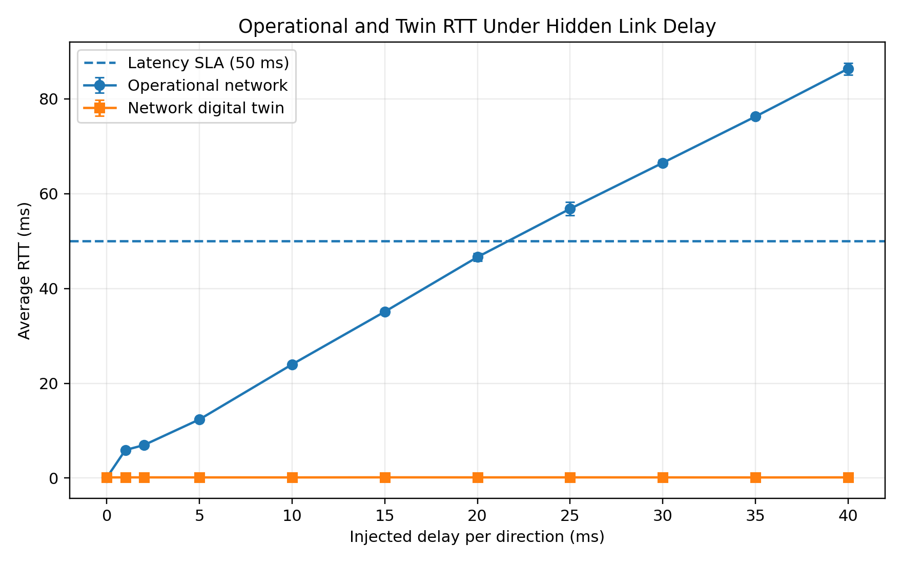
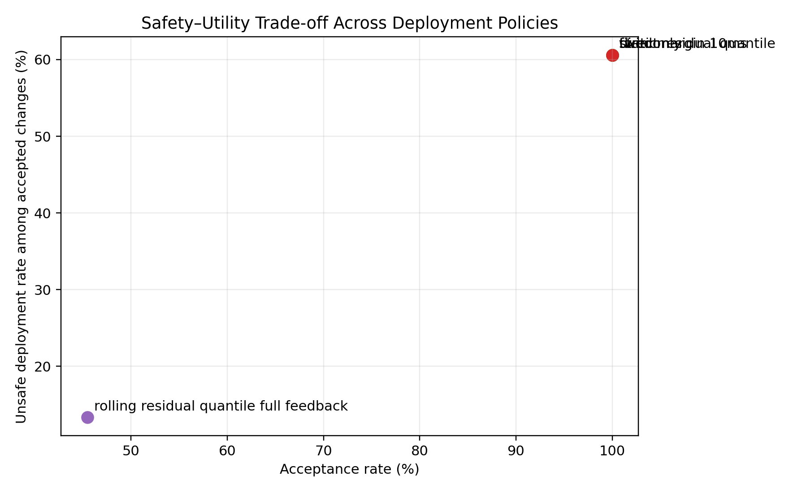
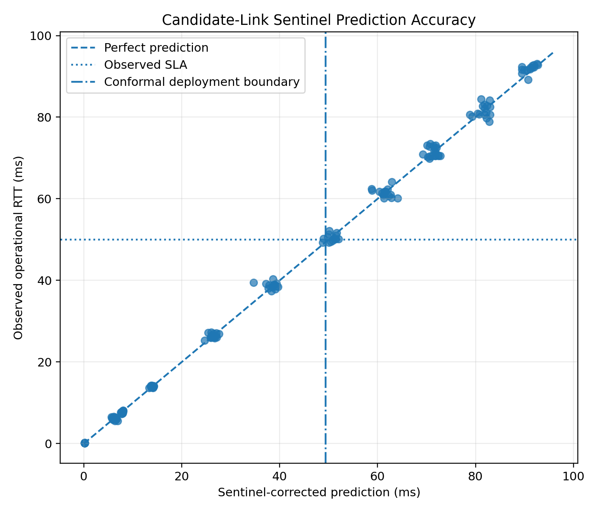
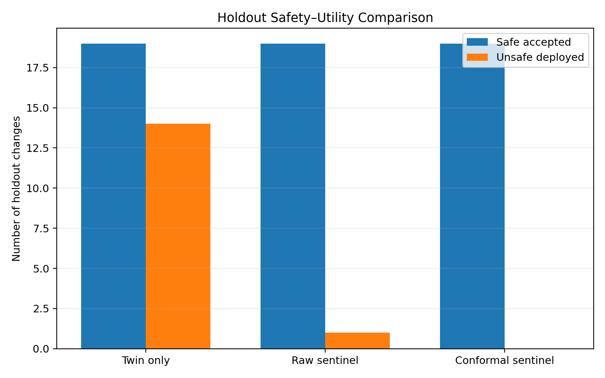
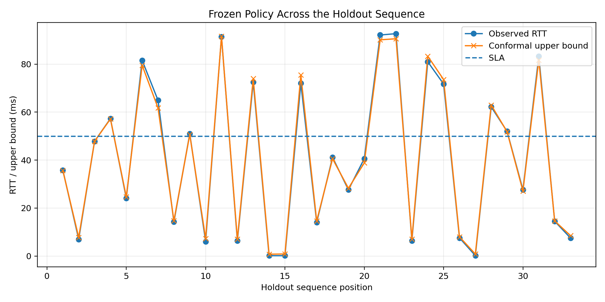

# Abstract

Network digital twins can validate routing changes before deployment, but a
control-plane-consistent twin may still be unsafe when operational link
performance has drifted. We study OSPF link-cost reconfiguration in
Containerlab/FRRouting operational and twin networks. Both environments
converge to the same candidate route, while hidden latency is injected only on
the operational link activated by the change. In an initial false-safe case,
the twin predicts 0.166 ms but the operational
path reaches 66.274 ms and violates a 50 ms SLA.
Static and larger rolling residual margins reject every candidate, while
the only non-vacuous rolling window still admits unsafe changes. We therefore
introduce a candidate-link sentinel that probes the
activated link before deployment, corrects the twin end-to-end prediction by
the operational/twin link discrepancy, and applies a frozen one-sided 0.661 ms
margin. Across 186 validation candidates, the policy accepts 110 changes,
admits one unsafe change, and covers 97.32% of safe changes. On an untouched
33-sample holdout, it accepts all 19 safe changes and rejects all 14 unsafe
changes. The correction reduces holdout mean absolute prediction error from
40.917 ms to
0.990 ms. However, the upper score
covers only 20/33 holdout RTTs, so
the results support empirical safety and utility in the tested drift regime,
not nominal conformal coverage under distribution shift.

**Keywords:** network digital twin; OSPF; safe network automation; drift;
pre-deployment validation; calibrated uncertainty; FRRouting; Containerlab

# Introduction

Network digital twins (NDTs) are increasingly proposed as low-risk
environments for analyzing network state, evaluating candidate policies, and
supporting closed-loop automation. Current architectural work emphasizes that
a useful twin is not merely a static topology replica: it depends on data,
models, interfaces, and timely information from the physical network
[@zhou2026ndtarch; @zhou2026datacollection]. This dependence creates a
fundamental operational question. What happens when the control-plane model is
correct, but a performance property of the real network has drifted beyond the
state represented in the twin?

The question matters for routing changes. Open Shortest Path First (OSPF)
derives routes from administratively assigned link costs [@moy1998ospf], and
weight optimization is a long-established traffic-engineering mechanism
[@fortz2000ospf]. An operator or automation system can therefore evaluate a
candidate weight change in a twin and deploy it when the predicted route and
performance satisfy policy. However, the candidate can move traffic onto a
link whose current latency, loss, or capacity differs from the twin. In that
case, agreement on topology, protocol convergence, and next-hop selection does
not imply agreement on the service outcome.

Formal configuration-analysis systems can verify broad forwarding and
control-plane properties before deployment [@fogel2015batfish;
@beckett2017minesweeper; @prabhu2020plankton], while consistent-update
abstractions protect packet behavior during a configuration transition
[@reitblatt2012updates]. These approaches are essential but address a
different failure mode. A configuration may be reachable, loop-free, and
installed consistently, yet violate a latency service-level objective because
the operational link state is not faithfully represented by the validation
model.

This paper studies that gap in a controlled OSPF testbed. We construct
separate operational and twin networks using Containerlab and FRRouting. Both
networks have the same topology, OSPF configuration, candidate link costs, and
resulting routes. We then inject hidden latency drift on the direct link in
the operational network only. Lowering the OSPF cost makes both networks
select the same direct route, but the twin predicts sub-millisecond latency
while the operational path can exceed a 50 ms SLA. This produces a
false-safe deployment without a control-plane disagreement.

A first attempt to protect deployment with residual quantiles exposed a
second problem. The static margin and rolling windows of 20 and 50 observations
rejected every candidate. A rolling window of 10 observations accepted 16
candidates but admitted two unsafe changes and did not retain useful acceptance
across all randomized schedules. This result motivates a different observable: before
deploying a candidate OSPF change, probe the exact link that the change would
activate in both the operational network and the twin. The difference between
these link measurements corrects the twin's end-to-end prediction, after
which a frozen conformal margin is applied to the deploy/reject decision.

The resulting candidate-link sentinel substantially improves the tested
safety–utility trade-off. Across 186 validation changes, the frozen policy
accepted 110 candidates, accepted 109 safe candidates, and admitted one unsafe
candidate. On an untouched 33-sample holdout, it accepted all 19 safe
reconfigurations and rejected all 14 unsafe reconfigurations. The targeted
correction reduced mean absolute latency-prediction error from 40.917 ms for
the uncorrected twin to 0.990 ms on the holdout. The conformal margin also
prevented one unsafe deployment that the raw sentinel would have accepted.

The holdout result must be interpreted carefully. Although the binary
deployment decisions were correct for all 33 holdout samples, the nominal 95%
conformal upper-bound coverage did not persist under the shifted residual
distribution. The paper therefore makes an empirical claim about the tested
latency-drift regime, not a distribution-free safety guarantee. This
distinction is consistent with conformal research showing that exchangeability
violations require weighted, adaptive, or online treatment
[@tibshirani2019covariate; @gibbs2021adaptive; @gibbs2024online].

The paper makes four contributions:

1. **A reproducible false-safe NDT case.** We demonstrate an OSPF
   reconfiguration for which the operational network and twin agree on the
   route but disagree on whether the resulting latency satisfies the SLA.
2. **A negative result for residual-only gating.** We show that a global
   residual-quantile policy can collapse into complete abstention under mixed
   drift schedules.
3. **A pre-deployment candidate-link sentinel.** We introduce a targeted
   measurement that is available before deployment and corrects the twin
   prediction using the link the candidate change would activate.
4. **A separated safety and coverage evaluation.** We report validation and
   untouched-holdout deployment outcomes while explicitly documenting the
   failure of nominal conformal predictive coverage under shift.

The present scope is deliberately narrow: one three-router OSPF topology,
link-cost changes, and hidden latency drift. This narrow design permits a
fully reproducible causal demonstration, but it does not establish behavior
under capacity, loss, topology, or multi-link drift, nor at production scale.

# Related Work

## Network digital twins

NDT research frames the twin as a virtual representation connected to the
physical network through data, models, and interfaces. The current IRTF NMRG
reference-architecture draft describes NDTs as a foundation for data-driven
management and lower-risk evaluation of network changes
[@zhou2026ndtarch]. Complementary data-collection work states that building
and updating the twin requires real-time information from the represented
network [@zhou2026datacollection]. These documents are active
Internet-Drafts and should be cited as work in progress rather than standards.

Almasan et al. describe NDT architecture, enabling machine-learning
technologies, and a QoS-aware routing-optimization case study
[@almasan2022ndt]. Hui et al. organize data-driven network performance
modeling around fidelity, efficiency, and flexibility, and identify limited
production data as a major challenge [@hui2022performance]. More recent
routing work combines an NDT performance model with what-if route
recommendations for transport slicing [@abenathar2025routeopt]. Our work
differs by holding control-plane behavior constant and directly testing the
risk created by an unobserved performance difference between the twin and the
operational network.

Recent systems broaden the operational use of twins. Aether combines agentic
AI, verification, simulation, and emulation in an automated change-validation
workflow [@auge2026aether]. MirrorNet reconstructs and synchronizes a
production software-defined WAN for high-fidelity emulation
[@miao2026mirrornet], while REAL reduces the resource cost of running
unmodified control-plane containers [@xia2026real]. An active architectural
draft also integrates NDT capabilities into agent-driven network analysis,
decision, validation, and execution [@wu2026agentndt]. These works reinforce
the importance of accurate and synchronized validation environments. The
candidate-link sentinel is narrower: it supplies a quantitative
pre-deployment check for the specific link a routing change would activate.

## OSPF traffic engineering

OSPF is a link-state interior gateway protocol in which routers compute
shortest-path trees from a synchronized topology database and configured
metrics [@moy1998ospf]. Fortz and Thorup established OSPF weight optimization
as a practical traffic-engineering mechanism and showed that optimized
weights can approach general-routing performance in studied networks
[@fortz2000ospf]. Their problem is selecting effective weights given network
and demand information. Our problem begins after a candidate weight change
has been selected: whether its predicted performance remains valid when the
twin lacks the current latency state of the newly preferred link.

## Configuration verification and safe updates

Network configuration analysis can proactively derive forwarding behavior
and test properties before deployment. Fogel et al. combine declarative
control-plane modeling with data-plane analysis [@fogel2015batfish].
Minesweeper uses symbolic reasoning to verify network-wide properties under
modeled environments [@beckett2017minesweeper], and Plankton combines
symbolic partitioning with explicit-state model checking for scalable
multi-protocol verification [@prabhu2020plankton].

A separate line of work protects the transition between configurations.
Reitblatt et al. define consistent network-update abstractions so packets are
processed according to well-defined old or new configurations
[@reitblatt2012updates]. These approaches are complementary to our gate.
They can establish route properties and transition correctness, but a
performance-SLA failure can remain when the operational link state is outside
the model. Our experiments intentionally create this separation: both twin
and operational routers install the same OSPF route, while only the
operational path experiences hidden latency.

## Conformal prediction and distribution shift

Conformal prediction offers finite-sample marginal coverage under
exchangeability. Tibshirani et al. extend the framework to covariate shift
through importance weighting when the test-to-training density ratio is known
or accurately estimated [@tibshirani2019covariate]. Gibbs and Candès propose
adaptive conformal inference for online distribution shift
[@gibbs2021adaptive] and later develop online inference methods for arbitrary
distribution changes [@gibbs2024online]. Bates et al. provide a related
framework for controlling expected prediction-set loss using holdout
calibration [@bates2021risk].

The present method uses a much simpler frozen split-conformal margin. The
margin improved the binary deployment decision in our holdout, but the
nominal predictive coverage failed under the shifted residual distribution.
We therefore do not claim the guarantees of weighted, adaptive, online, or
risk-controlling conformal methods. Instead, these methods define the
statistical path for extending the candidate-link sentinel beyond the current
controlled experiment.

## Position relative to prior work

The reviewed literature separately provides NDT architectures and performance
models, OSPF optimization, formal configuration verification, consistent
updates, and conformal methods under distribution shift. Our study focuses on
their intersection: a candidate OSPF change is control-plane correct and
twin-approved, but unsafe because a performance property of the activated
link has drifted. The proposed sentinel uses a targeted operational
measurement available before deployment, rather than relying exclusively on
the global historical residuals of the twin.

# System and Threat Model

## System scope

We study pre-deployment validation of one class of network changes: modifying
OSPF link costs so that traffic is moved from an indirect path to a direct
link. The system consists of two isolated but structurally identical
environments:

- an **operational network**, which represents the network in which a
  candidate change would be deployed; and
- a **network digital twin**, which is used to simulate the same candidate
  before deployment.

Both environments run unmodified FRRouting 10.5.1 instances inside
Containerlab. Each contains three routers, \(r_1,r_2,r_3\), connected as a
triangle, and three end hosts, \(h_1,h_2,h_3\), attached to the corresponding
routers. IPv4 forwarding is enabled on the router containers, and all
router-to-router OSPF interfaces are configured as point-to-point links.

Let the operational and twin topologies be
\(G^{o}=(V,E)\) and \(G^{t}=(V,E)\). In the experiment, the node set, link set,
IP addressing, OSPF configuration, and candidate configuration are identical
between \(G^{o}\) and \(G^{t}\). The environments differ only in an unmodeled
performance property injected into the operational network.

## Baseline and candidate OSPF states

The baseline OSPF costs are:

- \(w(r_1,r_2)=10\);
- \(w(r_2,r_3)=10\); and
- \(w(r_1,r_3)=30\).

The destination LAN attached to \(r_3\) contributes the default OSPF interface
cost of 10. Consequently, the route from \(r_1\) toward
`192.168.13.0/24` has metric 30 through \(r_2\) in the baseline state.

The candidate change \(c\) lowers the OSPF cost of the direct
\(r_1\)--\(r_3\) link from 30 to 5 in both directions. After convergence, the
destination route has metric 15 and uses the direct next hop at
`192.168.2.2`. The same candidate is evaluated in the operational and twin
environments.

## Service objective and safety label

The primary service metric is the mean round-trip time from \(h_1\) to
\(h_3\), measured using 20 ICMP echo requests. Let

\[
Y^{o}(c)
\]

denote the realized operational mean RTT after candidate \(c\), and let

\[
\widehat{Y}^{t}(c)
\]

denote the mean RTT predicted by executing the candidate in the twin.

The latency service-level threshold is

\[
\tau = 50\text{ ms}.
\]

A realized candidate is labeled safe when

\[
Y^{o}(c) \leq \tau,
\]

and unsafe when

\[
Y^{o}(c) > \tau.
\]

The experiment also records packet loss and the installed route. However, the
deployment label used in the present paper is based only on mean RTT. All
reported Phase 5 samples retain the same OSPF metric and next hop in the
operational network and the twin.

## Drift model

The drift source is non-malicious performance desynchronization rather than a
security attacker. The operational direct link \(r_1\)--\(r_3\) receives an
additional `netem` delay \(d\) on each direction, where

\[
d \in \{0,1,2,5,10,15,20,25,30,35,40\}\text{ ms}.
\]

No corresponding delay is inserted in the twin. Because the impairment is
applied in both directions, its RTT contribution is approximately \(2d\),
subject to container and scheduling noise.

This construction models a twin that is correct about topology, OSPF state,
and the candidate configuration, but stale or incomplete with respect to the
current latency of the link that the candidate will activate. It deliberately
isolates performance-plane drift from control-plane disagreement.

## Information available to the deployment policy

The policy may use the following information before an operational
deployment decision:

1. the candidate OSPF change and the link it is expected to activate;
2. the candidate's simulated end-to-end RTT in the twin;
3. a direct RTT probe of the candidate link in the operational network;
4. the corresponding candidate-link probe in the twin;
5. the fixed SLA threshold; and
6. a margin frozen using an independent calibration set.

The operational post-change RTT \(Y^{o}(c)\) is **not** a policy input. It is
collected only to label the candidate and evaluate the decision.

The experimental harness applies every candidate to the operational network
after collecting the pre-deployment probes so that ground-truth outcomes are
available for all policies, including candidates that a policy would have
rejected. Policy decisions are then replayed from fields available before
deployment. A live controller would instead simulate the candidate in the
twin, compute the decision, and apply the candidate operationally only when
the gate accepts it.

## Assumptions

The current design makes the following assumptions:

- the candidate link is known from the proposed OSPF change;
- the link remains directly reachable for an active probe before deployment;
- probe traffic is small enough not to materially alter network performance;
- the operational state does not change materially between the probe and the
  deployment decision;
- the candidate affects one identifiable direct link;
- both OSPF instances converge before end-to-end measurements are collected;
- the latency SLA is known and fixed; and
- calibration observations are not drawn from the final holdout schedule.

The implementation identifies the candidate link explicitly for the
three-router topology. Automatic candidate-path differencing is a proposed
extension, not part of the evaluated artifact.

## Out-of-scope failures

The present threat model does not cover:

- malicious manipulation of probes or telemetry;
- packet-loss, capacity, queueing, or topology drift as the primary impairment;
- simultaneous drift on multiple links;
- failed or unreachable candidate links;
- changes to multiple OSPF weights in one transaction;
- interaction between concurrent controllers;
- transient packet consistency during installation; or
- large-scale and multi-area OSPF networks.

These exclusions bound the current claim to empirical latency safety for the
tested single-link OSPF reconfiguration.

# Candidate-Link Sentinel Method

## Method overview

The candidate-link sentinel augments the twin's simulated end-to-end
prediction with a targeted measurement of the link that the candidate OSPF
change would activate. The method has four stages:

1. identify the candidate link;
2. probe that link in the operational network and the twin;
3. correct the twin's candidate prediction using the observed link mismatch;
4. add a one-sided calibration margin and compare the result with the SLA.

The targeted probe is available even when the candidate is ultimately
rejected. This differs from residual-only adaptation, which may depend on
observing post-deployment outcomes.

## Candidate-link measurement

For candidate \(c\), let \(e_c\) be the link expected to become preferred after
the OSPF cost change. The current implementation fixes

\[
e_c = (r_1,r_3).
\]

Before changing the operational OSPF cost, \(r_1\) sends 20 ICMP echo requests
to the directly connected \(r_3\) address `192.168.2.2`. Addressing the
neighbor interface directly forces the probe over \(e_c\), even while the
baseline route toward \(h_3\) still traverses \(r_2\).

Let

\[
L^{o}(e_c)
\]

be the operational mean candidate-link RTT, and let

\[
L^{t}(e_c)
\]

be the corresponding mean RTT in the twin.

The measured one-sided link discrepancy is

\[
\Delta(c) =
\max\left(0,\;L^{o}(e_c)-L^{t}(e_c)\right).
\]

The maximum with zero makes the correction conservative for an upper-latency
SLA: an operational link that is faster than its twin does not reduce the
predicted RTT, while a slower operational link increases it.

## Corrected candidate prediction

The candidate is simulated in the twin to obtain the end-to-end prediction

\[
\widehat{Y}^{t}(c).
\]

The sentinel-corrected prediction is

\[
\widetilde{Y}(c)
=
\widehat{Y}^{t}(c)+\Delta(c).
\]

This correction assumes that the dominant operational/twin discrepancy lies
on the newly activated link and that the link-level RTT difference transfers
approximately to the end-to-end path. The assumption is appropriate for the
controlled single-link latency experiment, but it is not a general
decomposition theorem.

## Calibration residual

For calibration candidate \(i\), the signed one-sided residual is

\[
R_i =
Y^{o}_i-\widetilde{Y}_i.
\]

Positive residuals indicate that the realized operational RTT exceeded the
corrected prediction. Because the objective is an upper latency bound, the
method uses an upper residual quantile rather than the absolute residual.

Let \(n\) be the number of independent calibration observations and
\(\alpha\) the target tail level. The finite-sample order-statistic rank is

\[
k =
\min\left(
n,\;
\left\lceil(n+1)(1-\alpha)\right\rceil
\right).
\]

After sorting the residuals as
\(R_{(1)}\leq\cdots\leq R_{(n)}\), the margin is

\[
q_{\alpha}=R_{(k)}.
\]

For the frozen policy,

\[
n=22,\qquad
\alpha=0.05,\qquad
k=22,\qquad
q_{\alpha}=0.661\text{ ms}.
\]

The margin is computed once from `calibration_seed77` and is not updated using
validation or holdout outcomes.

## Deployment rule

The one-sided upper score for candidate \(c\) is

\[
U(c)=\widetilde{Y}(c)+q_{\alpha}.
\]

The frozen deployment policy is

\[
\pi(c)=
\begin{cases}
1, & U(c)\leq\tau,\\
0, & U(c)>\tau,
\end{cases}
\]

where \(\pi(c)=1\) means deploy and \(\pi(c)=0\) means reject.

For the present experiment, \(\tau=50\) ms and
\(q_{\alpha}=0.661\) ms. No policy parameter is changed after the validation
decision is frozen.

## Policy pseudocode

```text
Input:
    candidate c
    candidate link e_c
    SLA threshold tau
    frozen residual margin q_alpha

1. Simulate c in the network twin.
2. Measure twin candidate RTT: y_twin.
3. Probe e_c in the operational network: l_ops.
4. Probe e_c in the twin: l_twin.
5. delta <- max(0, l_ops - l_twin)
6. corrected <- y_twin + delta
7. upper <- corrected + q_alpha
8. if upper <= tau:
       return DEPLOY
   else:
       return REJECT
```

In the experimental harness, Step 1 is followed by applying the candidate to
the operational network solely to collect \(Y^{o}(c)\) for evaluation. That
ground-truth measurement is not used in Steps 3–8.

Although Phases 4 and 5 share schedule definitions, their measurements were
collected independently. Consequently, threshold-near observations differ:
Phase 4 contains 121 safe and 65 unsafe validation outcomes, whereas Phase 5
contains 112 safe and 74 unsafe outcomes.

## Compared policies

The experiment evaluates four deployment policies:

### Direct deployment

\[
\pi_{\text{direct}}(c)=1.
\]

Every candidate is deployed without twin validation.

### Twin-only validation

\[
\pi_{\text{twin}}(c)
=
\mathbb{1}
\left[
\widehat{Y}^{t}(c)\leq\tau
\right].
\]

This policy trusts the uncorrected twin prediction.

### Raw candidate-link sentinel

\[
\pi_{\text{raw}}(c)
=
\mathbb{1}
\left[
\widetilde{Y}(c)\leq\tau
\right].
\]

This policy uses the candidate-link correction without a residual margin.

### Conformal candidate-link sentinel

\[
\pi_{\text{sentinel}}(c)
=
\mathbb{1}
\left[
\widetilde{Y}(c)+q_{\alpha}\leq\tau
\right].
\]

This is the policy frozen before holdout evaluation.

## Validation-selection rule

A candidate policy is considered operationally non-vacuous only when it
accepts at least one candidate and at least one safe candidate. It must also
accept a safe candidate in every validation schedule. Among policies
satisfying these conditions, selection minimizes the number of unsafe
deployments, then maximizes safe-change coverage, then maximizes total
acceptance.

This rule prevents a policy from being selected merely because it rejects
every candidate. In Phase 4, residual-only rolling policies with windows 20
and 50 had zero unsafe deployments but also zero accepted candidates; they
were therefore rejected as vacuous.

## Evaluation metrics

For \(N\) candidates, let \(D_i=\pi(c_i)\) be the binary deployment decision
and let

\[
Z_i=\mathbb{1}[Y^{o}_i>\tau]
\]

be the unsafe label.

The acceptance rate is

\[
\mathrm{AR}
=
\frac{1}{N}\sum_{i=1}^{N}D_i.
\]

The number of unsafe deployments is

\[
\mathrm{UD}
=
\sum_{i=1}^{N}D_iZ_i.
\]

The unsafe rate among accepted candidates is

\[
\mathrm{URA}
=
\frac{\sum_i D_iZ_i}
     {\sum_i D_i},
\]

when at least one candidate is accepted.

Safe-change coverage is

\[
\mathrm{SC}
=
\frac{
\sum_i D_i(1-Z_i)
}{
\sum_i (1-Z_i)
}.
\]

The paper also reports mean absolute prediction error, root mean squared
prediction error, route agreement, and Wilson confidence intervals for
binomial rates.

## Computational cost

For a fixed candidate link and \(P\) probe packets, the online arithmetic is
constant time after measurement. The measurement cost is \(O(P)\), while twin
simulation and OSPF convergence dominate wall-clock latency. Calibration
requires sorting \(n\) residuals, with \(O(n\log n)\) time and \(O(n)\) storage.
The current artifact does not measure controller runtime overhead separately.

## Statistical interpretation

The margin is split-conformal-style, but the paper does not claim that it
retains nominal 95% predictive coverage under arbitrary drift. On the
untouched holdout, the binary deployment classifier separated all tested safe
and unsafe candidates, while the upper score covered only 20 of 33 realized
RTTs. The supported conclusion is therefore empirical evidence of safety and
utility in the tested latency-drift regime, not a distribution-free coverage
or zero-risk guarantee.

# Experimental Methodology

## Research questions

The evaluation addresses four research questions:

- **RQ1 — False-safe twin behavior:** Can an OSPF candidate be
  control-plane consistent between the operational network and its twin while
  violating the operational latency SLA?
- **RQ2 — Residual-only gating:** Does a global residual-calibration policy
  retain useful acceptance under heterogeneous and shifted delay schedules?
- **RQ3 — Targeted drift sensing:** Does probing the candidate link before
  deployment improve latency prediction and the safety–utility trade-off?
- **RQ4 — Untouched evaluation after freezing:** Does the selected policy retain
  useful behavior on a randomized holdout that is not used for calibration or
  policy selection?

The experiment is designed as a controlled causal study rather than a
production-scale benchmark. The manipulated variable is the hidden
per-direction latency on the operational candidate link; the twin topology,
routing configuration, candidate configuration, and host workloads are held
constant.

## Execution environment

Experiments run on an Apple-silicon MacBook Pro using an Ubuntu machine
provided by OrbStack. Containerlab version 0.77.0 orchestrates the network
containers.

Routers use:

```text
quay.io/frrouting/frr:10.5.1
```

End hosts use:

```text
wbitt/network-multitool:3.22.2
```

The operational laboratory is named `ospf-ops`, and the twin laboratory is
named `ospf-twin`. Each environment runs independently so that operational
impairments do not modify the twin.

## Network topology

Each environment contains three FRRouting routers arranged in a triangle, with
one host attached to each router.

{#fig:testbed-topology}

The number on each router-to-router edge denotes the baseline OSPF cost. Host
\(h_2\) is attached to \(r_2\), although the primary measured flow is
\(h_1\rightarrow h_3\).

The candidate changes the direct \(r_1\)--\(r_3\) cost from 30 to 5 on both
ends. The baseline route from \(r_1\) to the LAN behind \(r_3\) uses \(r_2\)
and has metric 30. The candidate route uses the direct link and has metric 15,
including the destination-interface cost.

Before each schedule, a readiness script confirms:

1. both laboratories are deployed;
2. every expected OSPF adjacency is in the `Full/-` state;
3. the destination route is installed; and
4. \(h_1\) can reach \(h_3\).

## Controlled drift injection

The operational candidate link is the direct
\(r_1\)--\(r_3\) connection. The experiment applies Linux `netem` delay to the
corresponding interface on both operational endpoints. The twin receives no
delay modification.

The per-direction delay levels are

\[
D =
\{0,1,2,5,10,15,20,25,30,35,40\}
\text{ ms}.
\]

Applying delay in both directions produces an approximate round-trip
contribution of \(2d\), with normal container and host-scheduling variation.

For each sample, the harness first sets the requested delay and returns OSPF
to the baseline cost state. After the sample has been parsed, the next sample
sets its own delay and baseline state. At the end of a schedule, delay is reset
to zero and the baseline costs are restored.

## Per-sample protocol

Each sample executes the following sequence:

1. apply the operational delay level;
2. set operational and twin OSPF costs to the baseline state;
3. send 20 ICMP probes from operational \(r_1\) to operational
   `192.168.2.2`;
4. send the corresponding 20 probes in the twin;
5. set both environments to the candidate OSPF state;
6. record the installed route to `192.168.13.0/24` in both environments;
7. send 20 end-to-end ICMP probes from \(h_1\) to \(h_3\) in each
   environment; and
8. parse the measurements into a structured sample summary.

Pings use an interval of 0.1 s and a response timeout of 2 s. The parser
records packet-loss percentage and minimum, mean, maximum, and variation of
RTT. FRRouting's BusyBox-style three-value link-probe summary is supported by
treating the missing variation field as zero.

The scripts do not override ICMP payload size, so each container's default
`ping` payload is used. No warm-up request or first reply is discarded: the
reported mean is the summary mean over all received replies from the 20
requests. The candidate-state script waits 2 s after updating the OSPF cost on
both endpoints before route and end-to-end measurements are collected.

The direct link probes occur before the operational candidate is applied.
The post-change operational end-to-end measurement is collected only to
construct ground truth for evaluation. It is not an input to the deploy/reject
rule.

## Dataset partitions

### Calibration

The calibration schedule `calibration_seed77` contains 22 samples: two
observations for each of the 11 delay levels. Their order is randomized using
seed 77. These samples determine the fixed one-sided residual margin.

### Validation

Policy selection uses 186 validation samples from five schedules:

| Schedule | Samples | Design purpose |
|---|---:|---|
| `randomized_seed101` | 33 | Three randomized repetitions of each delay |
| `randomized_seed202` | 33 | Independent randomized ordering |
| `randomized_seed303` | 33 | Independent randomized ordering |
| `abrupt_shift` | 45 | Low-delay regime, abrupt high-delay regime, then recovery |
| `up_down` | 42 | Repeated ascending and descending delay sweeps |
| **Total** | **186** | |

The three randomized schedules expose the policy to order variation while
preserving the same delay support. The abrupt-shift and up/down schedules test
whether policy utility depends on a stationary or smoothly ordered sequence.

### Untouched holdout

The holdout schedule `holdout_seed909` contains 33 samples: three observations
for each of the 11 delay levels in a randomized order generated with seed 909.

The holdout is not used to compute the margin, compare candidate policies, or
select a policy. The policy manifest fixes the method, SLA, calibration size,
order-statistic rank, residual margin, prediction rule, and deployment rule
before holdout evaluation.

## Experimental phases

The artifact records the development process as separate phases.

### Phase 1 — convergence smoke test

The first phase verifies that the three-router OSPF laboratory converges and
that changing the direct-link cost moves traffic to the intended route.

### Phase 2 — first false-safe twin case

A hidden 30 ms per-direction delay is applied to the operational direct link.
After the candidate OSPF change, both environments select the direct route.
The twin predicts a sub-millisecond RTT, whereas the operational RTT is about
66 ms and violates the 50 ms SLA. This establishes RQ1.

### Phase 3 — delay sweep and preliminary gates

A 55-sample delay sweep explores the relation between injected delay,
operational RTT, twin error, and residual-based gates. This phase is
exploratory and is not used as the final untouched holdout.

### Phase 4 — residual-only policy validity

A 22-sample calibration set and 186 validation samples evaluate static and
rolling residual policies. The static policy and rolling windows of 20 and 50
observations reject every candidate. The rolling window of 10 observations is
non-vacuous but admits two unsafe changes and fails the cross-schedule utility
criterion. These results motivate method revision.

### Phase 5 — candidate-link sentinel

The candidate-link sentinel uses the same schedule definitions and the same
22/186 calibration-validation sizes, but Phase 5 is an independent measurement
run rather than a reuse of Phase 4 records. The calibrated sentinel is selected
and frozen before the 33-sample holdout is evaluated once.

## Compared policies

Four policies are evaluated from the same sample records:

- **Direct:** deploy every candidate.
- **Twin only:** deploy when twin end-to-end RTT is at most 50 ms.
- **Raw sentinel:** deploy when the corrected prediction is at most 50 ms.
- **Conformal sentinel:** deploy when the corrected prediction plus the
  frozen 0.661 ms margin is at most 50 ms.

Using common sample records permits paired comparison. Every policy receives
the same pre-deployment observables and ground-truth label.

## Policy-selection protocol

Candidate policies are compared only on calibration and validation data. A
policy is ineligible when it:

- accepts no candidates;
- accepts no safe candidate; or
- fails to accept at least one safe candidate in every validation schedule.

Among eligible policies, selection is lexicographic:

1. minimize unsafe deployments;
2. maximize safe-change coverage; and
3. maximize total acceptance.

This protocol explicitly rejects complete abstention as a misleading safety
result.

The selected conformal candidate-link sentinel is recorded in
`frozen_policy.json` with:

- calibration size 22;
- \(\alpha=0.05\);
- finite-sample rank 22;
- margin 0.661 ms;
- latency SLA 50 ms;
- the exact prediction and deployment rules; and
- SHA-256 hashes of the validation inputs.

## Holdout execution and incident disclosure

The holdout runner checks that the frozen-policy manifest exists and that no
completed holdout-results file is present. It refuses a second evaluation
after `holdout_results.json` has been created.

During the first holdout sample, raw measurements were collected before the
policy manifest had been committed because the results directory was ignored
by the initial `.gitignore`. Parsing then stopped because the link probe used
a three-value BusyBox ping summary rather than the four-value format expected
by the parser.

The raw first-sample files were preserved. The parser was modified only to
accept both ping formats, and the existing measurements were parsed without
remeasurement. No margin, SLA, policy rule, schedule, or sample value was
changed. The policy file and parser correction were committed in a new commit,
and the holdout runner skipped the completed first summary before collecting
the remaining 32 samples. The incident is disclosed in
`docs/holdout_execution_log.md`.

This sequence means the first measurement preceded the Git commit containing
the manifest, although the policy parameters already existed in the file and
were not modified after measurement. The paper should describe the holdout as
untouched for policy selection while transparently reporting this procedural
deviation.

## Outcome variables

The primary policy outcomes are:

- accepted candidates;
- unsafe deployments;
- unsafe rate among accepted candidates;
- safe accepted candidates;
- safe rejected candidates;
- safe-change coverage; and
- acceptance rate.

Prediction quality is reported using:

- mean absolute error;
- root mean squared error;
- corrected residuals; and
- Pearson correlation between corrected prediction and observed RTT.

The experiment also checks route agreement between the operational network
and twin.

## Statistical reporting

For proportions, the analysis reports 95% Wilson confidence intervals. A
zero observed unsafe count is not reported as proof of zero true risk.

The conformal upper score is separately evaluated as a predictive bound. This
distinguishes:

1. binary deployment-classification performance relative to the 50 ms SLA;
   and
2. empirical coverage of realized RTT by the upper score.

This distinction is necessary because the holdout decisions were all correct,
while the nominal 95% upper-bound coverage was not achieved.

## Integrity and reproducibility controls

The artifact uses the following controls:

- generated schedules are stored as CSV files;
- processed rows preserve sample ID, schedule, position, delay, repetition,
  role, and seed;
- validation and holdout results are stored as JSON;
- the policy manifest records source hashes;
- holdout-result files prevent automatic second execution;
- dated provenance records separate policy freezing, holdout completion,
  evaluator correction, and final analysis;
- analysis files record the parser incident and evaluator correction; and
- the final holdout dataset is checked for 33 unique IDs, positions 1–33,
  three repetitions per delay, consistent safety labels, and universal route
  agreement.

## Threats to validity

### Internal validity

Container scheduling and active-probe variation introduce measurement noise.
The use of 20 probes per measurement reduces but does not eliminate this
variation. All policies are evaluated on the same samples, limiting
between-policy confounding.

The experimental harness applies rejected candidates to collect their
counterfactual operational outcomes. This differs from live enforcement but
is necessary to estimate false-safe and false-reject decisions. The policy
logic is computed only from information available before deployment.

### Construct validity

Mean ICMP RTT is a narrow proxy for service performance. The experiment does
not establish behavior for application latency, tail latency, throughput,
packet loss, or congestion.

### External validity

The topology contains three routers, one OSPF area, one candidate link, and a
single weight change. Results cannot be assumed to generalize to large,
multi-area, multi-vendor, or highly dynamic production networks.

### Statistical conclusion validity

The calibration and holdout sets are small. Confidence intervals remain wide,
and the nominal conformal coverage assumption is violated under the observed
residual shift. The main conclusion is therefore an empirical demonstration
and not a universal risk guarantee.

# Results

## RQ1: A route-consistent twin can make a false-safe latency decision

The baseline and hidden-drift experiment isolates performance-plane
desynchronization. Before drift, the operational network and twin use the
indirect route through \(r_2\), both with OSPF metric 30. Their mean end-to-end
RTTs are 0.153 ms and
0.184 ms, respectively.

After a 30 ms per-direction delay is hidden on the operational direct link,
the candidate OSPF change causes both environments to select next hop
`192.168.2.2` with metric 15. The twin reports
0.166 ms and therefore predicts that the
candidate satisfies the 50 ms SLA. The operational network instead measures
66.274 ms, producing a
66.108 ms residual and violating the SLA.

This is a false-safe decision without route disagreement: the modeled
control-plane outcome is correct, but the modeled performance state is not.

{#fig:rtt-delay}

## RQ2: Residual-only gates become unsafe or vacuous

Phase 4 evaluates 186 validation candidates after calibration on 22 samples.
Direct deployment, twin-only validation, and a fixed 10 ms margin accept every
candidate and each deploys 65 unsafe changes. The static upper residual margin
is 85.569 ms, which already exceeds the 50 ms SLA; it therefore rejects all
186 candidates, including all 121 safe candidates.

Rolling residual calibration does not provide a satisfactory compromise.
Window 10 accepts only 16 candidates, admits two unsafe changes, and covers
14 of 121 safe candidates. Its safe coverage is 11.57%. Windows 20 and 50
accept no candidate. Window 10 also fails to accept a safe candidate in any of
the three randomized validation schedules.

| Policy | Accepted | Unsafe deployed | Safe accepted | Safe coverage | Interpretation |
| --- | --- | --- | --- | --- | --- |
| Direct | 186 | 65 | 121 | 100.00% | Unsafe baseline |
| Twin only | 186 | 65 | 121 | 100.00% | Twin fails to detect hidden drift |
| Static residual quantile | 0 | 0 | 0 | 0.00% | Complete abstention |
| Rolling residual, window 10 | 16 | 2 | 14 | 11.57% | Low utility and incomplete safety |
| Rolling residual, window 20 | 0 | 0 | 0 | 0.00% | Complete abstention |
| Rolling residual, window 50 | 0 | 0 | 0 | 0.00% | Complete abstention |

These results support the negative conclusion that a global residual history
does not provide robust operational utility in the tested mixture of latency
regimes. Zero unsafe deployments under complete abstention is not treated as
a successful safety result.

{#fig:residual-tradeoff}

## RQ3: Candidate-link sensing restores useful discrimination

Phase 5 uses the same 22 calibration observations and 186 validation
observations, but augments the twin prediction with the operational/twin RTT
difference measured on the candidate link. The validation partition contains
112 safe and 74 unsafe candidates.

Direct and twin-only deployment accept every candidate and deploy all 74
unsafe changes. The raw sentinel accepts 111 candidates: 109 safe and two
unsafe. Adding the frozen 0.661 ms margin accepts 110 candidates: 109 safe and
one unsafe. Thus, the conformal sentinel reduces unsafe deployments by

\[
\frac{74-1}{74}\times100 = 98.65\%
\]

relative to twin-only validation, while retaining 97.32% safe-change coverage.

| Policy | Accepted | Unsafe deployed | Unsafe among accepted | Safe accepted | Safe coverage |
| --- | --- | --- | --- | --- | --- |
| Direct | 186 | 74 | 39.78% | 112 | 100.00% |
| Twin only | 186 | 74 | 39.78% | 112 | 100.00% |
| Raw candidate-link sentinel | 111 | 2 | 1.80% | 109 | 97.32% |
| Conformal candidate-link sentinel | 110 | 1 | 0.91% | 109 | 97.32% |

The single unsafe accepted validation candidate occurs at 20 ms
per-direction delay. Its corrected prediction is
48.922 ms, its upper score is
49.583 ms, and its
observed RTT is 50.229 ms. Three safe
candidates are rejected, also around the 20 ms decision boundary. This
concentration indicates that remaining classification error is associated
with measurement variation near the SLA rather than failure to detect
high-delay regimes.

Across validation, the link correction reduces mean absolute prediction error
from 38.154 ms to
0.745 ms. The corrected prediction
has Pearson correlation \(r=0.9993\) with
observed RTT.

{#fig:validation-prediction}

## RQ4: The frozen policy retains correct decisions on the untouched holdout

The frozen conformal sentinel is evaluated once on the 33-sample
`holdout_seed909` schedule. The holdout contains 19 safe candidates and 14
unsafe candidates. The policy accepts all 19 safe candidates, rejects all 14
unsafe candidates, and makes no observed false-safe or false-reject decision.

| Actual outcome | Deploy | Reject |
| --- | --- | --- |
| Safe | 19 | 0 |
| Unsafe | 0 | 14 |

The holdout acceptance rate is 57.58%, close to the 59.14% validation
acceptance rate. No unsafe deployment is observed among the 19 accepted
changes. The 95% Wilson interval for the unsafe rate among accepted changes is
0.00%--16.82%, so the experiment does not
establish zero underlying risk. The 95% Wilson interval for the 33/33 observed
decision accuracy is 89.57%--100.00%.

The raw sentinel would have accepted one additional holdout candidate. For
that case, the corrected prediction is
49.985 ms, the frozen upper score is
50.646 ms, and the realized RTT is
50.967 ms. The 0.661 ms margin therefore
prevents one unsafe deployment without rejecting a safe holdout candidate.

{#fig:holdout-policy}

## Prediction accuracy and conformal-bound coverage are different outcomes

The candidate-link correction remains accurate on the holdout: mean absolute
error falls from 40.917 ms for the
uncorrected twin to 0.990 ms, with
Pearson correlation \(r=0.9991\).

| Partition | Samples | Twin-only MAE (ms) | Corrected MAE (ms) | Corrected RMSE (ms) | Pearson r | Upper-bound coverage |
| --- | --- | --- | --- | --- | --- | --- |
| Validation | 186 | 38.154 | 0.745 | 1.149 | 0.9993 | 150/186 (80.65%) |
| Holdout | 33 | 40.917 | 0.990 | 1.440 | 0.9991 | 20/33 (60.61%) |

However, the one-sided upper score covers only
150/186 validation observations
(80.65%) and
20/33 holdout observations
(60.61%). Nominal 95% predictive
coverage therefore does not persist under the shifted residual distribution.

The empirical deployment classifier and the predictive interval must not be
conflated. The classifier performs strongly because safe and unsafe candidates
are separated around the fixed 50 ms decision boundary in this experiment.
The interval itself does not satisfy the nominal coverage target. The result
supports empirical deployment safety and utility in the tested setting, not a
distribution-free conformal guarantee.

{#fig:holdout-sequence}

## Summary of research questions

- **RQ1:** Yes. Route agreement does not prevent a false-safe latency
  decision when the activated operational link has hidden delay.
- **RQ2:** No residual-only policy tested provides both robust safety and
  useful acceptance; several collapse into complete abstention.
- **RQ3:** Yes. Candidate-link correction sharply reduces prediction error
  and unsafe deployments while retaining high safe coverage.
- **RQ4:** The frozen policy makes no observed classification error on the
  33-sample holdout. This result is limited to the tested schedule: the sample
  is small and nominal conformal coverage fails.

# Discussion

## Why the targeted sentinel works

The false-safe failure is caused by a localized mismatch: the candidate OSPF
change activates a direct link whose operational delay is absent from the
twin. A global historical residual does not identify where the mismatch lies
and can mix observations from substantially different delay regimes. The
candidate-link sentinel instead measures the component most likely to
determine the post-change path.

In this controlled topology, the operational/twin link RTT difference transfers
directly to the end-to-end candidate path. The correction therefore removes
most of the dominant error while requiring only a small pre-deployment probe.
This is an example of using configuration semantics to choose a high-value
measurement: the proposed OSPF change identifies the link that requires
additional validation.

## Safety, utility, and abstention

A deploy/reject policy cannot be assessed by unsafe deployments alone.
Rejecting every candidate trivially produces zero deployed failures but
prevents all beneficial changes. Phase 4 demonstrates this problem directly:
the static margin and rolling windows of 20 and 50 observations abstain
completely, whereas the 10-observation window trades that vacuity for two
unsafe deployments and inconsistent cross-schedule utility.

The candidate-link sentinel provides a more useful balance. It rejects high
delay candidates while accepting nearly all safe validation candidates and
all safe holdout candidates. The policy-selection rule formalizes this by
requiring safe acceptance in every validation schedule before minimizing
unsafe deployments.

## The role of the conformal margin

The raw sentinel performs most of the correction. The frozen margin is small
relative to the hidden delay and changes only candidates close to the SLA. It
removes one unsafe validation decision and one unsafe holdout decision that
the raw sentinel would accept, while preserving the same validation safe
coverage and all holdout safe candidates.

This result does not validate the margin as a nominal 95% prediction bound.
Its empirical value here is decision-boundary protection. A future method
should calibrate explicitly for decision risk under nonstationarity rather
than interpreting a static split-conformal quantile as valid after arbitrary
distribution shift.

## Implications for NDT-assisted automation

The experiment suggests a general control pattern:

1. use the candidate configuration to predict which resources or links will
   become critical;
2. obtain targeted operational measurements of those resources before
   deployment;
3. compare them with their twin representations;
4. correct or invalidate the twin's prediction; and
5. abstain when the corrected upper score violates policy.

An agent-generated change could invoke this validator before execution. Formal
configuration verification would still be used to check reachability, loops,
and protocol behavior; consistent-update mechanisms would still govern
installation. The sentinel adds a complementary performance-fidelity check.

## Feedback availability

The candidate-link probe is available for rejected candidates, which avoids a
key weakness of outcome-only online adaptation: a controller does not need to
deploy an unsafe candidate to learn that the relevant link has drifted. The
post-change end-to-end outcome is still useful for monitoring and
recalibration after accepted deployments.

For more complex candidates, the active resource set may contain several
links or nodes. Extending the method would require automatic path
differencing, multiple probes, and a rule for combining their discrepancies.

## Decision accuracy versus interval validity

The holdout illustrates why binary accuracy and predictive coverage should be
reported separately. Every holdout decision is correct relative to the 50 ms
threshold, yet the upper score covers only 20 of 33 realized RTTs. Favorable
separation around the SLA can produce accurate decisions even when residual
tails differ from calibration.

The paper therefore avoids describing the method as a conformal guarantee
under drift. Weighted conformal prediction, adaptive conformal inference, or
risk-controlling prediction sets are plausible extensions, but each requires
additional assumptions, feedback, and evaluation.

# Limitations and Threats to Validity

## Topology and protocol scope

The testbed contains three routers in one OSPF area and evaluates one
bidirectional cost change. The candidate link is manually identified. Results
cannot be assumed to transfer to multi-area OSPF, equal-cost multipath,
multiple simultaneous weight changes, route redistribution, or large
production networks.

## Drift scope

The manipulated drift is fixed latency applied to one direct link. The study
does not evaluate loss, bandwidth reduction, queue buildup, jitter as a
primary outcome, failed links, topology drift, asymmetric impairments,
multiple drifting resources, or adversarial telemetry.

## Measurement scope

Mean ICMP RTT is the only deployment SLA. It does not represent application
response time, tail latency, throughput, or service-specific quality. Twenty
probes reduce noise but do not eliminate container scheduling and active
measurement variation.

## Experimental enforcement

Every candidate is operationally applied in the harness so that rejected
candidates receive a ground-truth label. Policy decisions are replayed only
from pre-deployment fields, but the artifact is an offline labeled evaluation
rather than a live controller that blocks rejected changes.

## Sample size and schedule support

Calibration uses 22 observations and the holdout contains 33 observations.
The delay values are discrete and known to the experimental design. Wilson
intervals remain wide, and perfect holdout classification should not be
interpreted as proof of negligible production risk.

## Statistical assumptions

The frozen split-conformal-style margin does not retain nominal 95% predictive
coverage on validation or holdout. Exchangeability under the residual
distribution is not established. The study therefore makes no
distribution-free coverage or risk-control claim.

## Procedural deviation

The first holdout measurement was collected before the policy manifest was
committed because the results directory was initially ignored by Git. Parsing
failed, the raw files were retained, and only the parser was changed to accept
the observed BusyBox format. The policy values already existed and were not
changed after the measurement. The incident is documented, but it remains a
deviation from the ideal sequence in which the manifest commit precedes every
holdout observation.

## Researcher degrees of freedom

The sentinel was introduced after residual-only methods failed in Phase 4.
This is legitimate method development, but Phase 4 is exploratory rather than
confirmatory evidence for the final method. Confirmatory support comes from
the policy-freezing protocol and the separate holdout. Independent
replication would provide stronger evidence.

# Reproducibility and Artifact Availability

The artifact contains separate Containerlab definitions for the operational
network and twin, FRRouting configurations, generated experiment schedules,
measurement and parsing scripts, processed calibration, validation, and
holdout datasets, the frozen policy manifest, analysis outputs, figures, and
dated provenance records for the experimental milestones.

Key reproducibility records include:

- `lab/phase5/results/frozen_policy.json`;
- `lab/phase5/results/validation_results.json`;
- `lab/phase5/results/holdout_results.json`;
- `processed-data/phase5_sentinel_dataset.csv`;
- `processed-data/phase5_holdout_dataset.csv`;
- `docs/holdout_execution_log.md`;
- `docs/phase5_evaluator_correction.md`; and
- `docs/method_implementation_traceability.csv`.

The frozen manifest records SHA-256 hashes for the dataset and the historical
pre-correction validation artifacts. The latter are preserved with
`_original` suffixes, and `frozen_hash_resolution.json` records the filename
mapping without changing the frozen manifest. Holdout outputs have a separate
hash list. The holdout runner refuses automatic re-evaluation after the final
results file exists. Corrected validation outputs and later recomputations use
distinct filenames so that the historical decision artifacts remain intact.

A versioned release archive, `ndt-ospf-artifact-v1.0.0.zip`, has been
prepared with the code, configurations, processed data, frozen manifests,
analysis outputs, figures, and checksums. A permanent public URL and DOI
will be added in a subsequent arXiv version after repository and Zenodo
deposit.

# Funding

This research received no external funding.

# Competing Interests

The author declares no competing interests.

# Data and Code Availability

The release `ndt-ospf-artifact-v1.0.0.zip` contains the Containerlab and
FRRouting configurations, schedules, measurement and analysis code, processed
calibration, validation, and holdout data, the frozen policy, figures, and
SHA-256 checksums. The holdout is archival evidence and must not be reused for
tuning. A permanent repository URL and Zenodo DOI will be added after public
deposit.

# Author Contributions

The author conceived the study, implemented the testbed, conducted the
experiments, analyzed the data, and prepared the manuscript and reproducibility
artifact.

# Conclusion

A network digital twin can agree with an operational network on OSPF
convergence, route metric, and next hop while still approving a change that
violates an operational latency SLA. In the controlled experiment, this
false-safe behavior is caused by hidden delay on the direct link activated by
the candidate cost change.

Residual-only uncertainty gates do not solve the problem reliably: the tested
static and larger rolling margins collapse into complete abstention, while the
smaller rolling window remains unsafe. A targeted candidate-link probe provides a more useful signal. By
correcting the twin prediction with the operational/twin link discrepancy and
applying a frozen 0.661 ms margin, the selected policy reduces unsafe
validation deployments from 74 to one while retaining 97.32% safe coverage.
On the 33-sample untouched holdout, it accepts all 19 safe candidates and
rejects all 14 unsafe candidates.

The result is an empirical demonstration, not a universal safety guarantee.
Nominal conformal predictive coverage fails under the shifted residual
distribution, and the topology, drift model, and sample size are limited.
Nevertheless, the study identifies a concrete design principle for safer
NDT-assisted automation: use the semantics of a proposed network change to
measure the resources it will activate before trusting the twin's
performance prediction.
